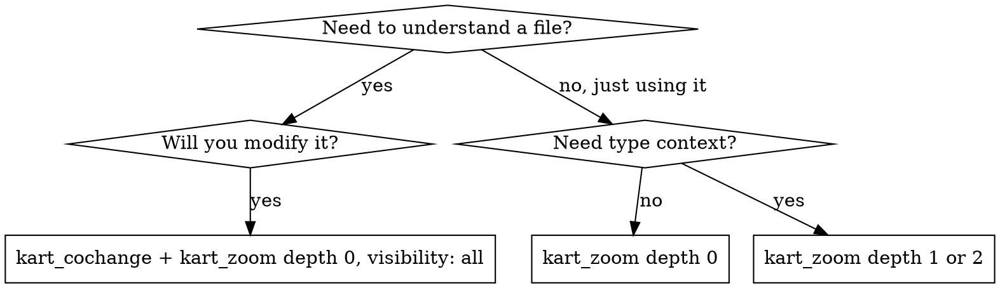

# /varp:zoom -- Progressive Code Disclosure

Use kart's MCP tools to manage context budget when navigating code.

## Quick Reference

| Question | Tool | Notes |
|----------|------|-------|
| "What does this module expose?" | `kart_zoom` depth 0 | Default. Exported signatures (`.d.ts` style) |
| "What types do the signatures reference?" | `kart_zoom` depth 1 | + declarations of types referenced in signatures (one-hop BFS) |
| "I need deeper type context" | `kart_zoom` depth 2 | Two hops through the type dependency graph |
| "Include non-exported symbols too" | `kart_zoom` depth 0, `visibility: "all"` | All declarations, not just exports |
| "Only show functions" | `kart_zoom` depth 0, `kind: ["function"]` | Filter by symbol kind |
| "Follow full type graph" | `kart_zoom` depth 0, `deep: true` | Traverse generics, constraints, full type graph |
| "What does this directory expose?" | `kart_zoom` on directory | depth 0 per file, no-export files omitted |
| "I need the full implementation" | `Read` tool | Use Read for raw file content |
| "Find a symbol by name" | `kart_find` | Fast oxc-parser scan, filter by kind/export |
| "Search for a pattern" | `kart_search` | Ripgrep-backed, gitignore-aware |
| "What files are in this dir?" | `kart_list` | Recursive, glob-filterable |
| "What else changes when I touch this?" | `kart_cochange` | Behavioral coupling from git history |
| "What breaks if I change this?" | `kart_impact` | Transitive callers via LSP |
| "What does this depend on?" | `kart_deps` | Transitive callees via LSP |
| "What are the lint/type errors?" | `kart_diagnostics` | oxlint `--type-aware` |
| "Where is this symbol used?" | `kart_references` | Cross-file references via LSP |
| "What does this file import?" | `kart_imports` | Resolved paths + symbol names |
| "What imports this file?" | `kart_importers` | Reverse lookup with barrel expansion |
| "Replace a symbol definition" | `kart_replace` | AST-aware with syntax validation |
| "Add code after/before a symbol" | `kart_insert_after` / `kart_insert_before` | Syntax-validated insertion |
| "Rename a symbol everywhere" | `kart_rename` | Reference-aware rename via LSP |

## When to Use Each Depth

```dot
digraph zoom_decision {
  "Need to understand a file?" [shape=diamond];
  "Will you modify it?" [shape=diamond];
  "Need type context?" [shape=diamond];
  "kart_zoom depth 0" [shape=box];
  "kart_cochange + kart_zoom depth 0, visibility: all" [shape=box];
  "kart_zoom depth 1 or 2" [shape=box];

  "Need to understand a file?" -> "Will you modify it?" [label="yes"];
  "Need to understand a file?" -> "Need type context?" [label="no, just using it"];
  "Need type context?" -> "kart_zoom depth 0" [label="no"];
  "Need type context?" -> "kart_zoom depth 1 or 2" [label="yes"];
  "Will you modify it?" -> "kart_cochange + kart_zoom depth 0, visibility: all" [label="yes"];
}
```

## Parameters

| Parameter | Type | Default | Description |
|-----------|------|---------|-------------|
| `depth` | `0 \| 1 \| 2` | `0` | Type graph traversal depth |
| `visibility` | `"exported" \| "all"` | `"exported"` | Filter by export status |
| `kind` | `string[]` | all kinds | Filter by symbol kind (function, class, type, etc.) |
| `deep` | `boolean` | `false` | Follow full type graph (generics, constraints) |

## Protocol

### Exploring unfamiliar code

1. Start with `kart_zoom` depth 0 on the file or directory -- see the exported contract
2. If you need type context for the signatures, use depth 1 (one hop) or depth 2 (two hops)
3. Use `visibility: "all"` when you need to see non-exported internals
4. Use `Read` when you need the full implementation source

### Before modifying a file

1. `kart_cochange` on the file -- check behavioral coupling neighbors
2. `kart_zoom` depth 0 with `visibility: "all"` on the file -- understand all symbols
3. Review top co-change neighbors before committing -- they may need coordinated changes

### kart vs serena

| serena | kart |
|--------|------|
| `find_symbol` -- locate a symbol by name | `kart_find` -- workspace-wide symbol search by name/kind/export |
| `find_referencing_symbols` -- direct references | `kart_impact` -- transitive callers (blast radius) |
| `get_symbols_overview` -- flat symbol list | `kart_zoom` depth 0 -- exported symbols with signatures |
| `read_file` -- full file content | `Read` tool -- use Read for raw file content |
| `search_for_pattern` -- regex search | `kart_search` -- ripgrep-backed text search |
| `replace_symbol_body` -- replace a symbol | `kart_replace` -- replace with syntax validation + diagnostics |
| `insert_after_symbol` / `insert_before_symbol` | `kart_insert_after` / `kart_insert_before` |
| `rename_symbol` -- rename across files | `kart_rename` -- reference-aware rename via LSP |
| (no equivalent) | `kart_diagnostics` -- oxlint `--type-aware` lint + type errors |
| (no equivalent) | `kart_imports` / `kart_importers` -- import graph queries |

kart is TypeScript-focused and lightweight (oxc-parser + oxlint). serena is cross-language with full LSP integration. For TypeScript projects, kart provides equivalent functionality with lower overhead.

## Common Mistakes

**Reading full files by default.** Start at depth 0. Most of the time you only need the exported contract.

**Skipping cochange before edits.** Files with high behavioral coupling but no import relationship are invisible to static analysis. `kart_cochange` surfaces these.

**Using depth 1/2 when you need raw source.** Depth controls type graph traversal, not implementation disclosure. For full file content, use `Read`.
