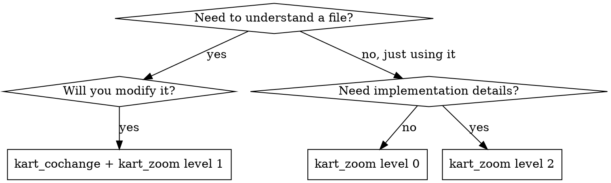

# /varp:zoom -- Progressive Code Disclosure

Use kart's MCP tools to manage context budget when navigating code.

## Quick Reference

| Question | Tool | Notes |
|----------|------|-------|
| "What does this module expose?" | `kart_zoom` level 0 | Default. Exported symbols + signatures + doc comments |
| "How does this module work internally?" | `kart_zoom` level 1 | All symbols including non-exported |
| "I need the full implementation" | `kart_zoom` level 2 or `read_file` | Full file content |
| "What does this directory expose?" | `kart_zoom` on directory | Level-0 per file, no-export files omitted |
| "What else changes when I touch this?" | `kart_cochange` | Behavioral coupling from git history |

## When to Use Each Level

## Protocol

### Exploring unfamiliar code

1. Start with `kart_zoom` level 0 on the file or directory — see the public contract
2. If you need internals, escalate to level 1
3. Only use level 2 when you need to read or modify the implementation

### Before modifying a file

1. `kart_cochange` on the file — check behavioral coupling neighbors
2. `kart_zoom` level 1 on the file — understand all symbols
3. Review top co-change neighbors before committing — they may need coordinated changes

### kart vs serena

| serena | kart |
|--------|------|
| `find_symbol` — locate a symbol by name | `kart_zoom` — see a module's contract without knowing symbol names |
| `find_referencing_symbols` — direct references | `kart_cochange` — behavioral coupling (files that change together) |
| `get_symbols_overview` — flat symbol list | `kart_zoom` level 0 — exported symbols with signatures and doc comments |
| `read_file` — full file content | `kart_zoom` level 2 — same content, structured response |

Use serena when you know what you're looking for. Use kart when you're orienting.

## Common Mistakes

**Reading full files by default.** Start at level 0. Most of the time you only need the public contract.

**Skipping cochange before edits.** Files with high behavioral coupling but no import relationship are invisible to static analysis. `kart_cochange` surfaces these.

**Using level 2 instead of read_file.** They return the same content. Use whichever is more natural for your workflow — level 2 adds no value over `read_file`.
